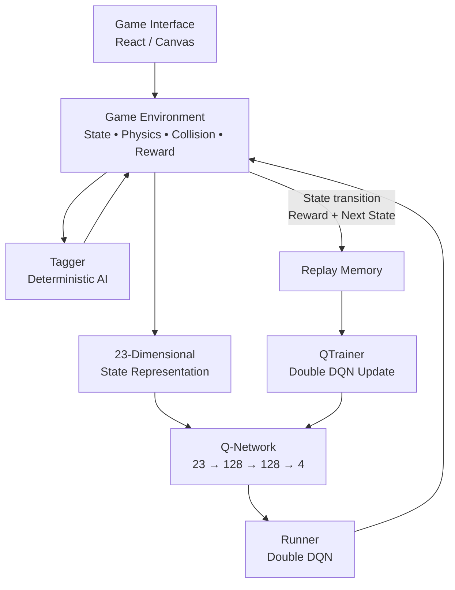
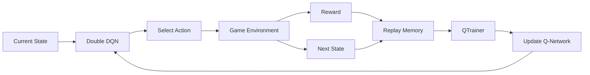
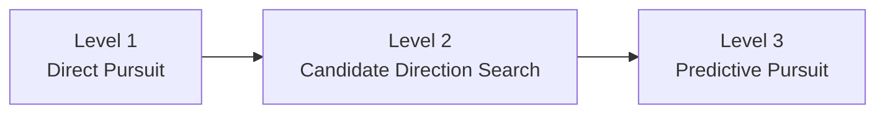
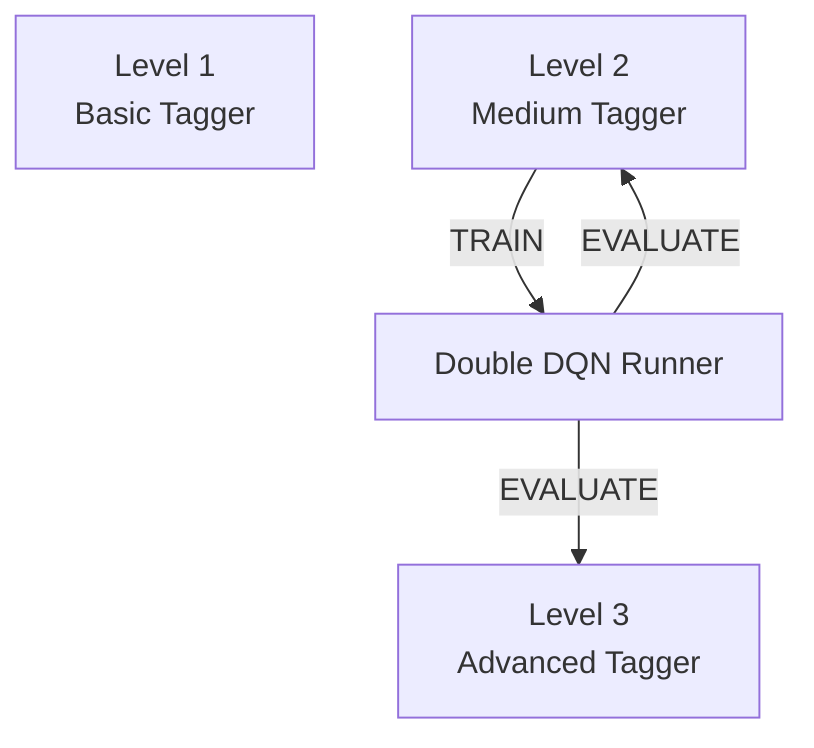

# AI Tag — Reinforcement Learning Pursuit & Evasion

<p align="center">
  <strong>A real-time pursuit-and-evasion environment featuring a Double DQN Runner and deterministic Tagger opponents.</strong>
</p>

<p align="center">
  
</p>

<p align="center">
  <a href="#overview">Overview</a> •
  <a href="#architecture">Architecture</a> •
  <a href="#reinforcement-learning">Reinforcement Learning</a> •
  <a href="#tagger-ai">Tagger AI</a> •
  <a href="#training--evaluation">Training & Evaluation</a> •
  <a href="#results">Results</a> •
  <a href="#setup">Setup</a>
</p>

---

## Overview

**TermiTag** is a real-time pursuit-and-evasion environment designed to explore reinforcement learning in a dynamic game setting.

The project features two competing agents:

* **Runner** — controlled by a Double Deep Q-Network (Double DQN)
* **Tagger** — controlled by deterministic pursuit algorithms with multiple difficulty levels

The Runner observes the game state and selects from four movement actions. During training, the Runner learns to maximize its survival time while maintaining distance from the Tagger and avoiding environmental hazards.

The primary experiment trains the Runner against a **medium-strength deterministic Tagger** and evaluates the resulting policy against both the training opponent and a **stronger Tagger that was not used during training**.

---

## Key Features

* Double DQN reinforcement-learning agent
* Experience replay
* Target network for stable Q-value learning
* Deterministic pursuit-based Tagger AI
* Multiple Tagger difficulty levels
* Real-time game environment
* Collision and boundary detection
* Reward shaping based on pursuit distance and environmental hazards
* Training and evaluation modes
* Browser-based visualization

---
## Development Process

### 1. Environment Design

When I created this project the goals I had in mind were learning to implement base level reinforcement learning AI, and testing 
whether that AI could successfully train against a tagger, then use what it learned to beat a higher level tagger

The rules are simple, the environment is a 600*800 px arena, by default there are a randomized number of walls 0 - 5
The tagger is tasked with touching the runner, and the runner must evade the tagger, winning when the timer reaches 0
Touching the wall or going out of bounds results in a point for the other player
Each game is first to 10 rounds

One important thing to notice is that the runner is controlled by the AI Policy, while the Tagger is deterministic. This is because
the tagger role is straight forward, while running is more open ended with various strategies. 

---

### 2. Deterministic Tagger Development

The Tagger was developed in multiple stages to create progressively more challenging opponents.

**Level 1 — Basic Pursuit**

[Explain how the first Tagger determines its movement.]

**Level 2 — Medium Pursuit**

[Explain how the medium Tagger improves upon Level 1. Mention candidate directions/search if applicable.]

**Level 3 — Advanced Pursuit**

[Explain the stronger Tagger's prediction/interception strategy.]

The Tagger difficulty was designed to increase through **decision-making complexity rather than simply increasing movement speed**.

---

### 3. Reinforcement Learning Agent

[Explain why the Runner was selected as the reinforcement-learning agent.]

The Runner uses a **Double Deep Q-Network (Double DQN)** to select movement actions based on the current game state.

[Briefly explain the state representation.]

[Explain the four available actions.]

[Explain the neural-network architecture.]

---

### 4. Reward & State Design

[Explain how you decided what information the Runner should observe.]

The state includes information about:

* Runner position and velocity
* Tagger position and velocity
* Relative Runner–Tagger position
* Boundary proximity
* Remaining time
* Nearby environmental obstacles

[Explain why these features are useful for learning evasive behavior.]

The reward system combines:

* [Terminal rewards]
* [Distance-based reward shaping]
* [Environmental hazard penalties]

[Explain the intended behavior produced by the reward function.]

---

### 5. Training Process

[Explain how the Runner was trained.]

Training was performed against the **medium-strength deterministic Tagger**.

[State the training configuration that is actually relevant: number of episodes, learning rate, discount factor, etc.]

[Explain how experiences were stored and replayed.]

[Explain how the target network / Double DQN update was used.]

---

### 6. Development & Iteration

[Describe the most important problems encountered during development.]

**Problem:** [What initially failed?]

**Investigation:** [What did you examine or test?]

**Change:** [What did you modify?]

**Result:** [What happened afterward?]

Repeat this format only for the **2–4 most meaningful iterations**.

---

### 7. Evaluation Strategy

After training, the Runner was evaluated against:

1. **The medium Tagger used during training**
2. **The stronger Tagger that was not used during training**

This was intended to determine whether the learned Runner policy could perform against an opponent with a more sophisticated pursuit strategy.

[Describe your actual evaluation procedure and number of games.]

---

### 8. Final Development Outcome

[Briefly summarize what the final system achieved.]

[State the most important result.]

[State the most important technical lesson or limitation discovered during development.]


---

## Architecture



### Training Loop



---

## Reinforcement Learning

### State Representation

The Runner receives a normalized **23-dimensional state representation** containing information about:

| Category          | Information                          |
| ----------------- | ------------------------------------ |
| Runner            | Position and velocity                |
| Tagger            | Position and velocity                |
| Relative Position | Runner-to-Tagger displacement        |
| Boundaries        | Distance to each arena boundary      |
| Time              | Remaining episode time               |
| Environment       | Relative Position of 2 closest walls |

This allows the agent to make decisions based on both the Tagger's current state and the surrounding environment.

### Action Space

The Runner has four discrete actions:

| Action | Behavior         |
| ------ | ---------------- |
| `0`    | Accelerate Up    |
| `1`    | Accelerate Down  |
| `2`    | Accelerate Left  |
| `3`    | Accelerate Right |

### Neural Network

```text
Input: 23 state values
        │
        ▼
   Fully Connected
      128 units
        │
       ReLU
        │
        ▼
   Fully Connected
      128 units
        │
       ReLU
        │
        ▼
   4 Q-values
```

The output represents the estimated value of each available action.

### Double DQN

The training process uses Double DQN to reduce overestimation of action values.

The online network selects the best next action, while the target network evaluates that selected action.

Conceptually:

```text
Online Network
      │
      ├── Select best next action
      │
      ▼
Target Network
      │
      └── Evaluate selected action
```

---

## Reward Function

The Runner receives both terminal and intermediate rewards.

### Terminal Rewards

| Event                       | Reward |
| --------------------------- | -----: |
| Runner survives the episode |    +30 |
| Runner is tagged            |    -30 |
| Runner leaves bounds        |    -30 |
| Runner collides with a wall |    -30 |

### Reward Shaping

Intermediate rewards incorporate a potential function using a telescopic reward shaping based primarily on:

* Distance from the Tagger
* Proximity to environmental hazards

This encourages the Runner to maintain separation while avoiding dangerous areas of the environment.

---

## Tagger AI

AI Tag includes multiple deterministic Tagger strategies with increasing levels of decision-making complexity.

### Difficulty Progression



### Level 1 — Direct Pursuit

The Tagger accelerates toward the Runner's current position.

### Level 2 — Search-Based Pursuit

The Tagger evaluates multiple possible acceleration directions and selects the direction that produces the strongest predicted approach toward the Runner.

### Level 3 — Predictive Pursuit

The strongest Tagger uses prediction of the Runner's future position to make its pursuit decisions.

This creates a natural difficulty progression without simply relying on increased movement speed.

---

## Training & Evaluation

The primary training experiment uses the following setup:



The Runner is trained against the **medium Tagger** and subsequently evaluated against:

1. The Tagger it trained against
2. A stronger Tagger that was not used during training

This provides a simple test of whether the learned policy can generalize beyond its training opponent.

---

## Results

> **Replace this section with your actual measured results. Do not use example numbers.**

| Runner Model            | Medium Tagger | Advanced Tagger |
| ----------------------- | ------------: | --------------: |
| Untrained Double DQN    |          `5%` |           `1%`  |
| 2500 episode Double DQN |         `65%` |           `20%` |
| 5k episode Double DQN   |         `73%` |           `50%` |

### Example Evaluation

```text
Evaluation Games: 100

Medium Tagger
Runner Wins: 15
Tagger Wins: 10
Win Rate: XX%

Advanced Tagger
Runner Wins: XX
Tagger Wins: XX
Win Rate: XX%
```

### Interpretation

The Runner was trained exclusively against the medium-strength Tagger. Performance against the stronger Tagger provides an indication of how well the learned evasion policy transfers to a more challenging opponent.

---

## Demo

<p align="center">
  
</p>

A short demonstration video is available below:

**[Watch the AI Tag demonstration](YOUR_VIDEO_LINK_HERE)**

The demonstration shows:

1. The game environment
2. The deterministic Tagger
3. The Double DQN Runner
4. Training/evaluation behavior
5. Performance against different Tagger levels

---

## Project Structure

```text
AI-Tag/
├── frontend/
│   └── ...
├── backend/
│   ├── Game.py
│   ├── Runner.py
│   ├── Tagger.py
│   ├── DQNPolicy.py
│   ├── QTrainer.py
│   └── model.py
├── assets/
│   ├── gameplay.gif
│   ├── architecture.png
│   └── demo.mp4
├── README.md
└── requirements.txt
```

> Adjust this structure to match the actual repository.

---

## Tech Stack

* **Python** — reinforcement learning and game logic
* **PyTorch** — neural network and Double DQN
* **React** — game interface
* **Flask** — backend/API
* **Socket.IO** — real-time communication
* **Git/GitHub** — version control and project documentation

---

## What I Learned

Through AI Tag, I explored:

* Reinforcement learning fundamentals
* Double Deep Q-Networks
* Experience replay
* Target networks
* Reward shaping
* State representation
* Deterministic pursuit algorithms
* Real-time interaction between an ML model and a game environment
* Evaluating learned policies against previously unseen opponents

---

## Limitations & Future Work

Current limitations include:

* The Runner is trained against a specific deterministic opponent.
* Performance can vary depending on the opponent strategy and environment configuration.
* The current action space is limited to four directional acceleration actions.

Potential future improvements include:

* Self-play reinforcement learning
* Additional opponent strategies
* More complex environments
* Larger action/state spaces
* More extensive evaluation across randomized environments

---

## Installation

```bash
git clone YOUR_REPOSITORY_URL

npm install

python pip install

cd frontend
npm run dev

cd backend
python main.py
```

Then follow the project-specific instructions for starting the backend and frontend.

---

## License

This project is licensed under the [MIT License](LICENSE).
